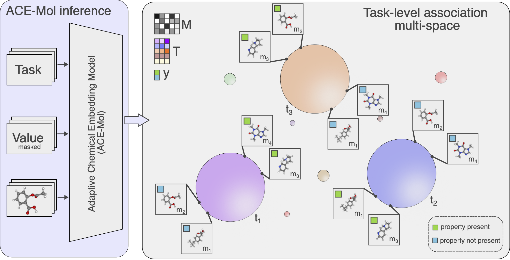

# ACE-Mol

<b>A</b>daptive <b>C</b>hemical <b>E</b>mbedding <b>Mo</b>de<b>l</b> (ACE-Mol) is a task-specific chemical embedding model trained on a large collection of programatically generated chemical motifs.



# How to guide

Here, we show how to use the current pre-trained ACEMol. Additionally, we showcase how to fine-tune or retrain your own version of ACEMol from scratch.

The text-based nature of ACEMol makes prediction of floating-point values quirky; we recommend embedding inputs and computing logprobs for prediction tasks.

## Set up the environment

```
conda create --name acemol --file requirements.txt python=3.12
```

## Use pre-trained ACEMol

PretrainedACEMol helper class enables easy use of the pre-trained models from [hf](https://huggingface.co/collections/jablonkagroup/ace-mol) or a local finetuned model from a .ckpt file.

```python
from src.pretrained import PretrainedACEMol

# Load pre-trained model (hf or local .ckpt)
acemol = PretrainedACEMol()
```

PretrainedACEMol accepts a list of SMILES, corresponding targets, and task descriptions (one task description is enough if it is shared).

```python
molecules = [
    'O=C(/C=C\\c1ccccc1)OCc1cncs1',
    'CCC(C)C(CN(C)C)c1ccc(Cl)cc1Cl',
    'CCOC(=O)CC(N)c1ccc(OC)cc1',
    'CN(C)Cc1ccccc1O',
    'COc1c(F)c(F)c(C(=O)Nc2ccccc2N2CCN(C(=O)C(C)C)CC2)c(F)c1F',
    'O=C(COC(=O)c1ccccc1F)NCc1ccc2c(c1)OCO2'
]
task = 'is halogen group present'

targets = [0, 1, 0, 0, 1, 1]
```

We recommend using ACE-Mol as an embedding model; the embed method will create an embedding excluding the actual target and prepare a dataframe for classification or regression via logprobs.

```python

embedded = acemol.embed(molecules, tasks, targets)

# split into train and test
train, test = embedded[:3], embedded[3:]

# use regress method for regression.
predictions = acemol.classify(train, test)
```

# Train your own model

We provide two additional scripts to re-train and fine-tune ACE-Mol.

## Data Format

We provide pre-training and toxicity [datasets](https://huggingface.co/collections/jablonkagroup/ace-mol).

If you want to use your own dataset for fine-tuning, you will have to use the same format as the datasets above.

## Training from scratch

```
python3 src/train.py \
 -c "./configs/config.yaml" \
 -e "./data/test" \
 -t "./data/train" \
 -v "./data/validation" \
 -m "model_name"
```

## Fine-tuning

```
python3 src/finetune.py \
 -p "jablonkagroup/ACEMol" \
 -c "./configs/finetune.yaml" \
 -e "./data/test" \
 -t "./data/train" \
 -v "./data/validation" \
 -m "model_name"
```

# Cite

```
@article{prastalo2026learning,
  title={Beyond Learning on Molecules by Weakly Supervising on Molecules},
  author={Gordan Prastalo and Kevin Maik Jablonka},
  journal={arXiv preprint arXiv:2602.04696},
  year={2026}
}
```
